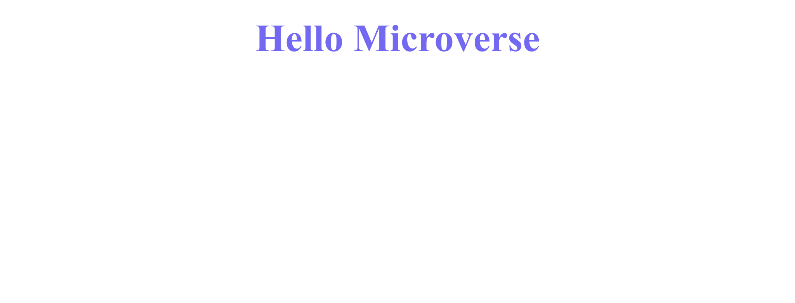

# hello-microverse

This Project is from the Microverse curriculum. Its main goal is to ensure students master the tools they will be using while submitting their projects. tools like the GitFlow, linter, etc.

## Built With

- HTML
- CSS

## Live Demo

[Live Demo Link](https://zieeco.github.io/hello-microverse/)

## Getting Started

To get a local copy up and running:

1. Clone this repository or download tha Zip folder.
**``git clone https://github.com/zieeco/hello-microverse.git``**

1. Navigate to the location of the folder in your machine:
**``you@your-Pc-name:~$ cd <folder>``**

## Author

👤 **Isaac Samuel**

- Github: [@zieeco](https://github.com/zieeco)

- LinkedIn: [Isaac Imaobong Samuel](https://www.linkedin.com/in/isaac-imaobong-samuel-a4849b1b8/)

## Contributing

Contributions, issues, and feature requests are welcome!

## Show your support

Give a ⭐️ if you like this project and how we manage to build it!

## 📝 License

This project is [MIT](./MIT.md) licensed
